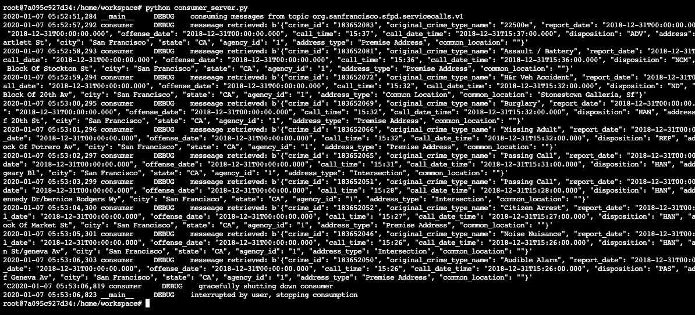
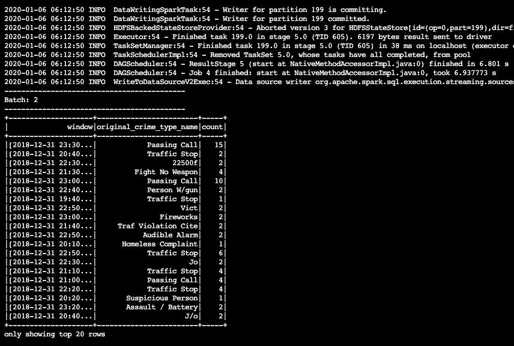
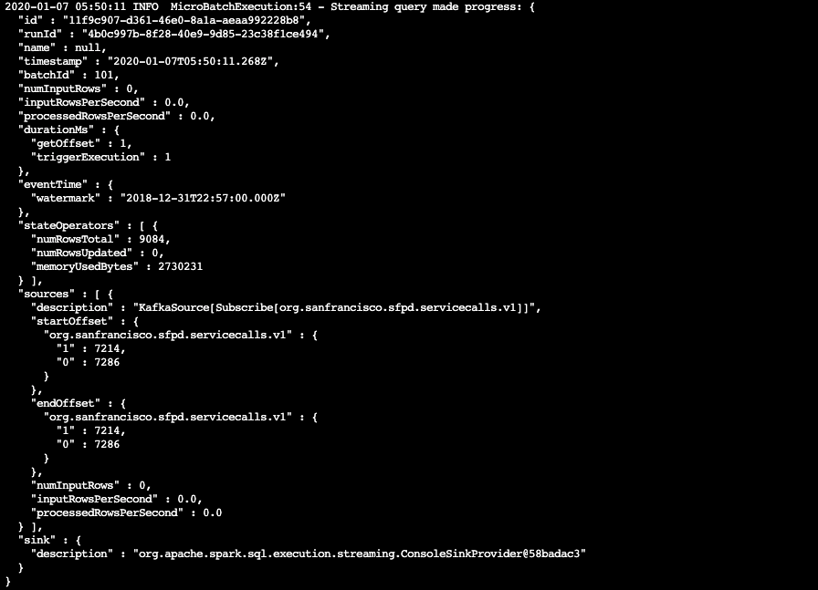

# SF Crime Statistics with Spark Streaming

The purpose of this project is to utilize Kafka to ingest [SF Police Calls for Service and Incidents dataset](https://www.kaggle.com/san-francisco/sf-police-calls-for-service-and-incidents) from Kaggle and consume them in Apache Spark using Structured Stream.

## Environment Requirements

This data pipeline was created against Spark 2.4.3 using Python 3.7.

## Data Pipeline Simulation Instructions

1. Start Zookeeper

```bash
bin/zookeeper-server-start.sh config/zookeeper.properties
```

2. Start Kafka broker

```bash
bin/kafka-server-start.sh config/server.properties
```

3. Start Kafka Python producer client to produce data

```bash
python kafka_server.py
```

4. (optional) Test consumption either through Kafka CLI or Kafka Python consumer client:

```bash
kafka-console-consumer --topic org.sanfrancisco.sfpd.servicecalls.v1 --bootstrap-server localhost:9092 --from-beginning
```

**OR**

```bash
python consumer_server.py
```

5. Start Spark job

```bash
spark-submit --packages org.apache.spark:spark-sql-kafka-0-10_2.11:2.4.4 --master local[*] data_stream.py
```

## Sample Outputs

### Kafka Consumption



### Spark Streaming Aggregation



### Spark Streaming Microbatch Progress



## Additional Questions

1. How did changing values on the SparkSession property parameters affect the throughput and latency of the data?

   After tweaking SparkSession parameters affected `processedRowsPerSecond` and `inputRowsPerSecond`. Higher throughput is and lower latency is desirable. The performance characteristics of the workload should be tailored around the data, the rate at which it is produced and our needs.

2. What were the 2-3 most efficient SparkSession property key/value pairs? Through testing multiple variations on values, how can you tell these were the most optimal?

   Our measure of workload performance is determined by throughput and latency. The optimal `processedRowsPerSecond` of ~412 was acheived by tweaking the following configurations:

   ```conf
   spark.default.parallelism       10
   spark.sql.shuffle.partitions    15
   ```